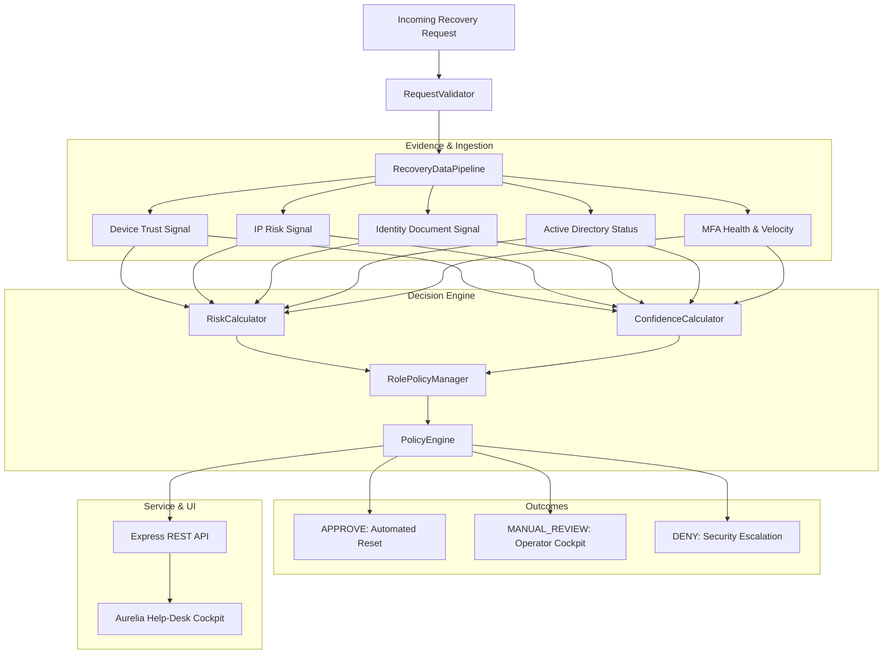

# System Architecture & Technical Design

## 1. Architectural Overview

The **Secure Account-Recovery Verification System** is designed as a modular, defense-in-depth platform composed of four loosely coupled subsystems:
1. **Data Ingestion & Pipeline Layer** (`src/data/`): Validates, cleanses, standardizes, and tags incoming identity and session telemetry.
2. **Analytical & Decision Engine Layer** (`src/engine/`): Houses the Baseline heuristic model, multi-signal Bayesian risk scoring, confidence modeling, and declarative role policies.
3. **API & Service Integration Layer** (`src/api/` & Express backend `server/index.ts`): Exposes RESTful endpoints for real-time ticket evaluation, simulation, rule re-configuration, and telemetry streaming.
4. **Agent Command Cockpit** (`client/src/`): A high-fidelity web dashboard built with React, Lucide-react, and Recharts, providing help-desk specialists with immediate situational awareness.



---

## 2. Component Directory Layout

```
/
├── data/
│   ├── raw/                        # Ingest fixtures & schema definitions
│   ├── synthetic/                  # 10k synthetic datasets with labels
│   ├── processed/                  # Normalized feature matrices
│   └── README.md                   # Schema and data dictionary
│
├── src/
│   ├── engine/
│   │   ├── risk_engine/            # Main orchestrator (RiskEngine)
│   │   ├── baseline/               # Legacy heuristic model (BaselineRecoveryModel)
│   │   ├── rules/                  # Role policies & deterministic triggers
│   │   ├── scoring/                # Composite risk & confidence calculators
│   │   └── evidence/               # Evidence extractors & signal aggregators
│   │
│   ├── data/
│   │   ├── generator/              # Reproducible synthetic generator (seed=42)
│   │   ├── preprocessing/          # Normalization & missing data handler
│   │   └── validation/             # Schema & bound validation
│   │
│   ├── api/                        # Python service routes & controllers
│   ├── models/                     # RecoveryRequest & RiskEvaluation models
│   └── config/                     # risk_rules.json & typed config loader
│
├── notebooks/
│   └── experiment.ipynb            # Interactive 12-stage evaluation notebook
│
├── tests/
│   ├── test_risk_engine.py         # Boundary & core engine tests
│   ├── test_baseline.py            # Baseline model assertions
│   ├── test_missing_data.py        # Missing telemetry tests
│   ├── test_delayed_data.py        # Delayed telemetry tests
│   ├── test_fraud_cases.py         # 5 adversarial fraud attack tests
│   ├── test_rules.py               # Role policy & hard block tests
│   └── test_failure_cases.py       # 7 executable failure scenarios
│
├── docs/
│   ├── FIELD_WORKFLOW.md           # Operational help-desk manual
│   ├── SYSTEM_ARCHITECTURE.md      # This document
│   ├── RISK_RULES.md               # Mathematical scoring & policy rules
│   ├── EXPERIMENT_RESULTS.md       # 10k benchmark results & ablation data
│   ├── FAILURE_MODE_ANALYSIS.md    # FMEA matrix across failure modes
│   ├── USER_VALIDATION.md          # Stakeholder usability testing protocol
│   ├── IMPLEMENTATION_GAP_ANALYSIS.md
│   └── results/                    # Confusion matrices & summary tables
│
└── README.md                       # Master execution manual
```

---

## 3. Telemetry Signal Ingestion

1. **Identity Evidence Score ($S_{id} \in [0.0, 1.0]$):**  
   Evaluates validity of secondary documents (student photo ID, passport OCR match, active single-sign-on claims).
2. **Device Trust Score ($S_{dev} \in [0.0, 1.0]$):**  
   Encodes device hardware fingerprint, OS patch level, presence of secure enclave, and prior login tenure.
3. **IP Risk Score ($S_{ip} \in [0.0, 1.0]$):**  
   Reverse lookup against threat intelligence feeds (Tor exit nodes, commercial data-center proxies, VPN egress points, geolocation velocity).
4. **Geographic & Behavioral Consistency ($S_{geo}, S_{login} \in [0.0, 1.0]$):**  
   Measures deviation from historical campus coordinate clusters and diurnal activity patterns.
5. **Directory Status:**  
   Direct query to Active Directory / LDAP. State of `SUSPENDED` forces instant termination.
6. **Recovery Velocity ($V \in \mathbb{N}$):**  
   Tracks rolling 48-hour recovery attempts across accounts and IP subnets. $V \ge 4$ activates an automated brute-force circuit breaker.

---

## 4. Security & Privacy Guarantees

- **No Real Credentials:** The prototype generates and evaluates synthetic identities and pseudonymous device fingerprints only.
- **Zero Plaintext Storage:** Passwords, seed tokens, and raw biometric hashes are never persisted.
- **Tamper-Evident Audit Trail:** Every evaluation outputs immutable reason codes, policy version strings, and feature breakdowns.
- **Separation of Concerns:** Evaluation logic is isolated from user record databases, ensuring test environments cannot corrupt operational identity stores.
